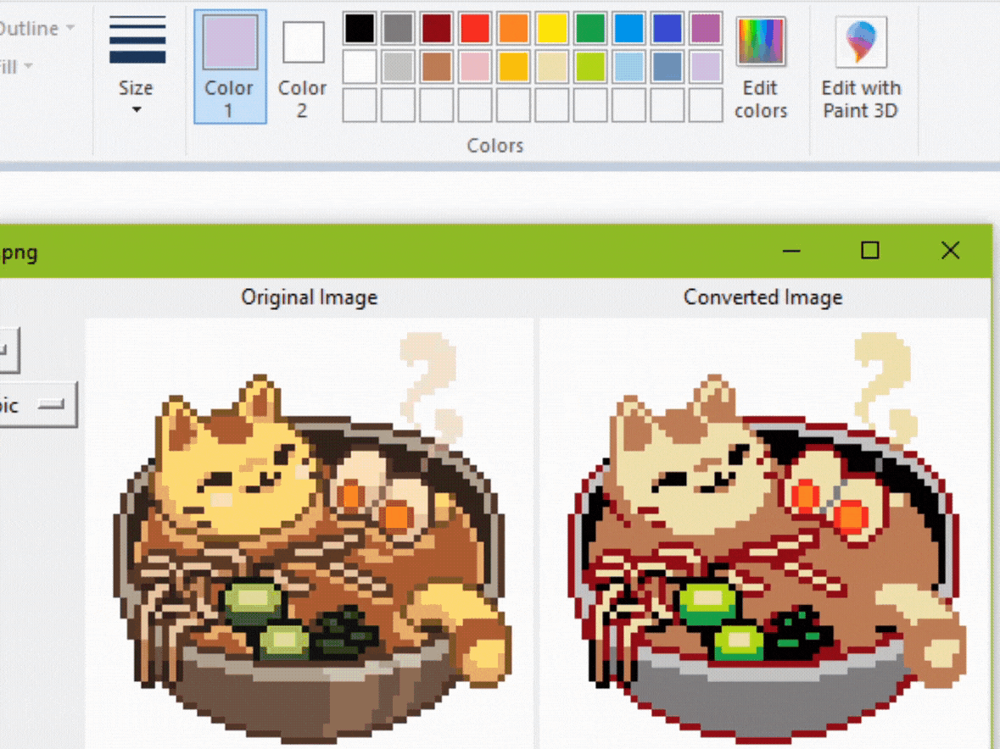
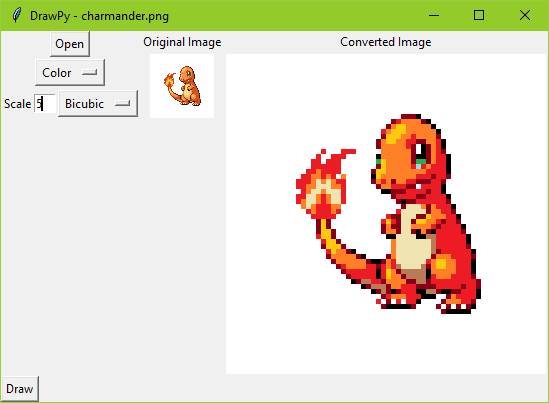

# drawpy
Drawing images in paint with pyautogui

Draws given image with a mouse using pyautogui for mouse movement and pillow for image analysis.

## Image Conversion
There are a lot of different ways you can draw an image in paint with a limited palette. DrawPy includes a couple of
basic options including black/white or color dithering, and nearest color based on the given palette. Most of these
use pillow to convert the images.

## Drawing

DrawPy draws an image by moving the mouse and clicking on the image's pixel data. This part is slightly optimized for
repeated colors since it can drag the mouse to the end of the repeated area instead of individually clicking each pixel.

In black and white mode, only black is draw and white is considered transparent so we don't need to change colors.

In color mode, the mouse needs to click on the palette to change colors. We use pyautogui to find our palette and save
the coordinates of those colors for future use.

## Gui
A simple gui (`gui.py`) is included that allows you to see a preview of what the drawn image will be. To support color drawing, the
palette file in use needs to be in view when this runs. **Note: screen color changers, e.g. f.lux, will prevent it from
finding the palette**
 

* **Open** open a new image. this will reset the scale. be careful about large images because the gui won't scale them
 down to the window size
* **Image Conversion Type Dropdown** the first dropdown allows you to choose among the following types
    * **BW** black and white image. white threshold is set at 128 by default
    * **BW Halftone** simple [halftone](https://en.wikipedia.org/wiki/Halftone) version
    * **BW Dither** black and white [Floyd-Steinberg dithering](https://en.wikipedia.org/wiki/Floyd%E2%80%93Steinberg_dithering)
    * **Color** nearest color image using a [red-weighted color distance approximation](https://www.compuphase.com/cmetric.htm)
    * **Color Dither** similar dithering technique as the black and white version but in color instead
    * **Scale** scale of image to be drawn. the dropdown next to it is the available [resampling filters](https://pillow.readthedocs.io/en/stable/handbook/concepts.html#concept-filters)
    * **Draw** draws the image, starting at where the mouse is. It'll wait 2 seconds for you to get ready before it starts.
        * ***WARN** once it starts the only way to stop it is to either get your mouse to the top left (very hard to do), log out, or do ctrl+alt+del*    
#
Paint seems to be the fastest to draw on. For other drawing programs, you probably need to increase `pyautogui.PAUSE` so
all of the actions grow through.

More paint programs can be supported by adding new `create_color_palette` methods to support different palettes with the
correct offset. A generic method could also be made by determining the color offsets via the palette image dimensions

More colors can be supported by added a method to click the `edit colors` button and choosing a color from there.
 
